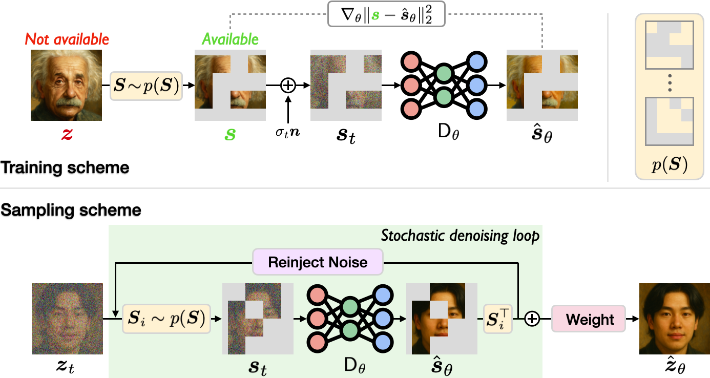

# Measurement Score-Based Diffusion Model



## Abstract
Diffusion models are widely used in applications ranging from image generation to inverse problems. However, training diffusion models typically requires clean ground-truth images, which are unavailable in many applications. We introduce the Measurement Score-based diffusion Model (MSM), a novel framework that learns partial measurement scores using only noisy and subsampled measurements. MSM models the distribution of full measurements as an expectation over partial scores induced by randomized subsampling. To make the MSM representation computationally efficient, we also develop a stochastic sampling algorithm that generates full images by using a randomly selected subset of partial scores at each step. We additionally propose a new posterior sampling method for solving inverse problems that reconstructs images using these partial scores. We provide a theoretical analysis that bounds the Kullback–Leibler divergence between the distributions induced by full and stochastic sampling, establishing the accuracy of the proposed algorithm. We demonstrate the effectiveness of MSM on natural images and multi-coil MRI, showing that it can generate high-quality images and solve inverse problems---all without access to clean training data.

## Environment setting

### 1) Virtual environment setup
```
cd MSM

conda create -n MSM python=3.9.19

conda activate MSM

conda install -c conda-forge mpi4py mpich

pip install -r requirements.txt
```

### 2) Download pretrained diffusion models ([Google Drive Link](https://drive.google.com/drive/u/1/folders/1hcS15aBcUSCJRKt4frr1ZI2E-_VkvzW-))

Save models to `./pretrained_models`.

| Dataset                           | Method                 | Pretrained Model Path                        |
|-----------------------------------|-------------------------|----------------------------------------------|
| FFHQ 128×128 (p = 0)              | Oracle Diffusion        | [Download Link](https://drive.google.com/file/d/1UcahMjVwcK7JKgHjOglGTnaCurCX44po/view?usp=sharing) |
| FFHQ 128×128 (p = 0.4)            | Measurement Diffusion   | [Download Link](https://drive.google.com/file/d/1eP96qKceUnENsR8B1PWKzlcio7TE9YtQ/view?usp=sharing) |
| FFHQ 128×128 (p = 0.4, η = 0.1)   | Measurement Diffusion   | [Download Link](https://drive.google.com/file/d/1mY_1cMie51LBJBZ-EDCVxjS-H8apgzOo/view?usp=sharing) |
| FastMRI 256×256 (R = 1)           | Oracle Diffusion        | [Download Link](https://drive.google.com/file/d/1UOSic2U-AIw_5pp_aNtdi6SnnMsJRKRW/view?usp=sharing) |
| FastMRI 256×256 (R = 4, η = 0)    | Measurement Diffusion   | [Download Link](https://drive.google.com/file/d/1z3whbmiY3mde-QU5WZlxZHSmuyZI-32U/view?usp=sharing) |
| FastMRI 256×256 (R = 4, η = 0.1)  | Measurement Diffusion   | [Download Link](https://drive.google.com/file/d/1kayX3-BeYcmVzqgDbBRDwcd0e7J_HDip/view?usp=sharing) |


### 3) Download demo MRI data

| Dataset                           | Usage                        | Data Path                        |
|-----------------------------------|------------------------------|----------------------------------------------|
| FastMRI Training Demo Sample      | For generation               | [Download Link](https://drive.google.com/drive/u/1/folders/13tohHufSniLRvsO_Yc7CFFM4lzH3KTT-) |
| FastMRI Test Sample               | For solving inverse problems | [Download Link](https://drive.google.com/drive/u/1/folders/13tohHufSniLRvsO_Yc7CFFM4lzH3KTT-) |
| FFHQ Test Sample                  | For solving inverse problems | MSM/datasets/ffhq_samples|

```diff
! Demo data is only for academic purposes, and if full fastMRI data is needed, please refer https://fastmri.med.nyu.edu/
```

## Train MSM / Sample using MSM

### 1) Pick one training scenario or testing setup from `configs` directory:

#### Train your own model

- **FFHQ 128 X 128**:
  - `configs/train/ffhq_msm_p04_noise0_0_img128.yaml`
  - `configs/train/ffhq_msm_p04_noise0_1_img128.yaml`

- **FastMRI 256 X 256**:
  - `configs/train/fmri_msm_R4_noise0_0_img256.yaml`
  - `configs/train/fmri_msm_R4_noise0_1_img256.yaml`

#### Unconditional image sampling

- **FFHQ 128 X 128**:
  - `configs/generation/ffhq_msm_p04_noise0_0_img128.yaml`
  - `configs/generation/ffhq_msm_p04_noise0_1_img128.yaml`

- **FastMRI 256 X 256**:
  - `configs/generation/fmri_msm_R4_noise0_0_img256.yaml`
  - `configs/generation/fmri_msm_R4_noise0_1_img256.yaml`

#### Solving inverse problems

- **FFHQ 128 X 128**:
  - `configs/inverseproblem/ffhq_SR4_msm_p04_img128_EPS.yaml`
  - `configs/inverseproblem/ffhq_BOX_msm_p04_img128_EPS.yaml`

- **FastMRI 256 X 256**:
  - `configs/inverseproblem/fmri_CSMRI4_msm_R4_noise0_0_img256.yaml`

### 2) Open `yaml` file and customize `# CUSTOMIZE`

```
# Open up the yaml file that you want to run experiment
vim {TASK_YAML_FILE_NAME}.yaml

# Only care about `ATTENTION' and customize as you wish.
setting:
  save_dir: experiment                                                          # Attention 1: saving folder name
  pretrained_model_dir: 'pretrained_models/ffhq_msm_p04_noise0_0_img128.pt'     # Attention 2: path for the pretrained model
  dataset_dir: 'datasets/ffhq_samples'                                          # Attention 3: path for the dataset 
```

### 3) Training MSM
```
# For training
python first_train.py --diffusion_config configs/{TASK_YAML_FILE_NAME}.yaml    # example code: python first_train.py --task_config configs/train/ffhq_msm_p04_noise0_0_img128.yaml
```

### 4) Sampling using MSM
```
# For unconditional sampling
python first_sample.py --diffusion_config configs/{TASK_YAML_FILE_NAME}.yaml    # example code: python first_sample.py --task_config configs/generation/fmri_msm_R4_noise0_0_img256.yaml

# For solving inverse problem
python first_sample.py --diffusion_config configs/{TASK_YAML_FILE_NAME}.yaml    # example code: python first_sample.py --task_config configs/inverseproblem/fmri_CSMRI4_msm_R4_noise0_0_img256.yaml
```

## Implementation detail

```
first_train.py                                 # Firstly called Python file for training
first_sample.py                                # Firstly called Python file for sampling
│   
└── guided_diffusion ─── train_util.py         # Include all training related configurations with data loading
							│   
							├── gauissian_diffusion.py       # Include specific training loss function for training
							│   
							└── unet.py                      # Contains MCM stochastic denoising block
```

## 🔑 Core Logic for MSM

These three components are central to the MSM framework:

```python
# Training with subsampled and noiseless data
guided_diffusion.gaussian_diffusion.training_losses_noiseless_msm

# Training with subsampled and noisy data
guided_diffusion.gaussian_diffusion.training_losses_noisy_msm

# Sampling methods for MSM
guided_diffusion.unet
```
